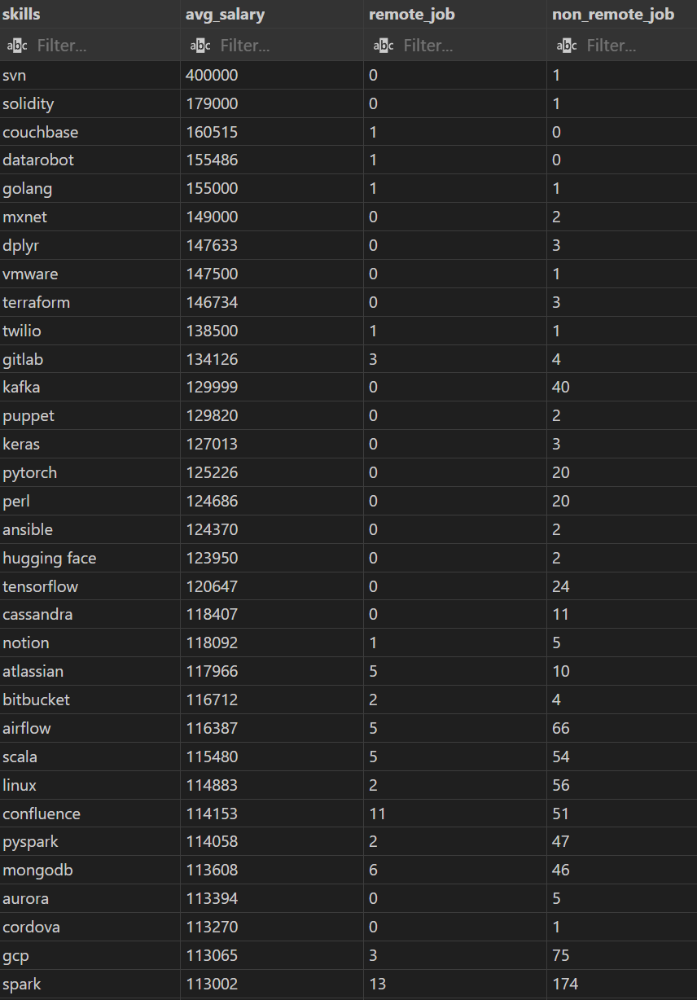
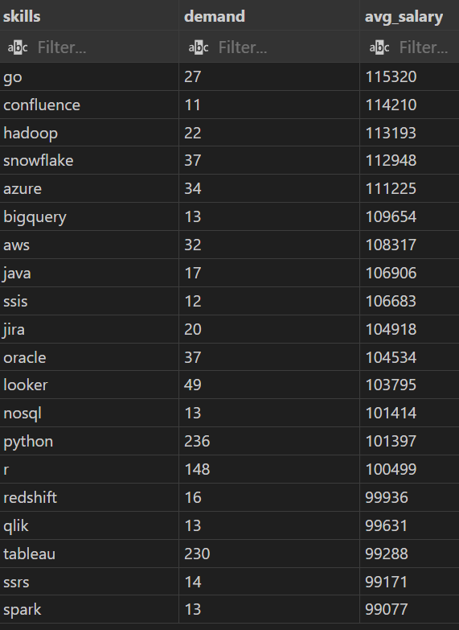

# Introduction
This project aims to uncover more details within the Data Job Market.

We shall dive deeper into particular details such as:
    Top-Paying jobs,
    In-Demand skills,
    Relations between high demand and high salary

All the codes will be listed within the folder here [sql_queries](/Capstone_Data_Job_Analysis/sql_queries/)

# Background
Understanding the impact of data analyst roles within the job market,
to further navigate the skills required and finding optimal requirements to breakthrough in this industry.

Datasets were provided from [SQL Course](https://drive.google.com/drive/folders/1egWenKd_r3LRpdCf4SsqTeFZ1ZdY3DNx) which covers necessary information(job_id, skill, salary, location, job title, etc...) required to support our findings.

### Questions closely related towards my goal findings:
1. What is the highest paying jobs(Think remote)?
2. What is the skills associated with the top-paying job(remote) listed by the company?
3. Which top 5 most in-demand skills assosciated with data analyst (remote and non-remote)?
4. What is the highest paid salary (by skill) associated with data analyst (remote and non-remote)?
5. What are the optimal skill to learn based of skills in-demand and highest paid salary?

>Why remote? With the rapid advancement of hardware and software technology, and current era of AI integrating into our everyday life, I do not see a reason as to why future jobs will not be implementing remote work. Did anyone forget about major companies allowing work from home during 2020 Covid?

# Tools I used
I utilized these key software that are integrated with each other.
- **PostgreSQL**: RDBMS to create my database(uploaded) for this project Data Job Market.
- **Visual Studio Code (VSC)**:  A powerful IDE that to perform and execute SQL queries.
- **SQL**:  Bread and butter of my data analysis, the language allows me to manipulate table, perform query on the data in a database for my findings.
- **Git & Github**:  Version control as well as syncing written queries (along with other amended files/folder) within VSC to share my findings online, demonstrate my insights, sharing my findings, as well as collaborating.
- **Excel CSV**: Extracted query table on VSC into Excel CSV will be used to create graph or tables in VSC.

> I have thought about using ChatGPT to create graphs out of query table or json file, but since I am a limited user, I decided to go create them by myself on excel instead.


# The Analysis
As stated in the beginning, my goal is to investigate and find key aspects of data analyst within the job market. Stated below is how I approach each questions.
> Do note, each titled questions is similarly stated in the [sql_queries](/Capstone_Data_Job_Analysis/sql_queries/).
Within each query files, I commented to showcase thought process as to why I perform slightly complex query when it is straight-forward.
I wanted to showcase my capabilities and understanding of the fundamentals of SQL for my first portfolio.

---
---


##  1st Question: Highest paying jobs
```sql
-- Top 10 only --

WITH top_ten_highest_pay AS
(
    SELECT
        company_id,
        job_id,
        job_title,
        job_location,
        job_schedule_type,
        salary_year_avg,
        job_posted_date
    FROM
        Job_postings_fact
    WHERE 
        (job_title_short = 'Data Analyst' AND
        job_work_from_home = TRUE AND
        salary_year_avg IS NOT NULL)
    ORDER BY 
        salary_year_avg DESC
    LIMIT 10
)

SELECT 
    c.name AS company_name,
    tt.job_title AS Job_title,
    tt.salary_year_avg AS ten_highest_paid_salary,
    tt.job_posted_date
FROM 
    company_dim AS c
INNER JOIN top_ten_highest_pay AS tt ON c.company_id = tt.company_id
ORDER BY
salary_year_avg DESC,
company_name ASC;
```


### Returned query table 


#### Findings
- **Potentially high salary**: The top ten highly paid jobs covers a wide range between $184,000 to $650,000
    - Spotting an Outlier, the highest paid company, Mantys has almost double the pay compared to the second highest paying company, Meta (Highly reputable company). 
    - The difference in paid salary between 2nd to 10th place shows a more reliable smooth trend pattern, which indicates to me a huge potential salary cap for becoming a data analyst.
- **Diversified company**: The result showcase variety of company from across spectrum of industry background taking interest into hiring data analyst.
    -A healthy telltale sign that shows a growing demand of data analyst (plus a specialization route within a data analyst.)
- **Multiple roles**: Within a field of data analyst, shows a healthy and diversied roles that adjust accordingly to different company needs.
    - This indicates that data analyst will be broken down into further specifity in the future, depending on the company background industry or their focus market.


### Column chart of the highest paying jobs(Data Analyst, inclusive of sub-branch)
 
Created through csv file(extracted from query table)

---
---


## 2nd Question: Skills associated with the highest paying jobs
``` sql
WITH highest_paying_job AS
(
SELECT
    c.name AS company_name,
    job_id,
    job_title,
    salary_year_avg
FROM
    job_postings_fact AS jp
INNER JOIN company_dim AS c ON jp.company_id = c.company_id
WHERE
    (job_title_short = 'Data Analyst' AND
        job_work_from_home = TRUE AND
        salary_year_avg IS NOT NULL)
ORDER BY
    salary_year_avg DESC
LIMIT 10
)

SELECT
    hp.company_name,
    hp.job_title,
    STRING_AGG(DISTINCT s.skills, ', ') AS skills_required,
    hp.salary_year_avg
FROM
    highest_paying_job AS hp
INNER JOIN skills_job_dim AS sj ON hp.job_id = sj.job_id
INNER JOIN skills_dim AS s ON sj.skill_id = s.skill_id
GROUP BY 
    hp.company_name,
    hp.job_title,
    hp.salary_year_avg
ORDER BY 
    salary_year_avg DESC,
    company_name DESC
;
```


### Returned query table 


#### Findings
- **Re-verification of top paying company**: Mantys and Meta didn't list down thier required skills despite being labelled as the top 2 highest paying company
    - Missing data does plays a crucial role here in the analysis, it could make or break the findings, however we still have enough data to list the most in-demand skills required to join this companies.
- **Highest in-demand skill**: SQL language appeared in all the company listed.
    - Python appeared in 7 out of 8 company being listed.
    - Tableau appeared in 6 out of 8 company being listed.
- **Non-favourable skill**: The remaining skill appeared to be of a varying degree, is least desireable because it will soon be obsolete? Or could it be that the skills are required by the company as it has always been part of their legacy, where it would be incompatible to integrate to newer software? This require complex and deeper analysis.


### Bar chart for the in-demand amongst the top paying company

Created through csv file(extracted from query table)

---
---


# 3rd Question: Most in-demand skill for data analyst
``` sql
SELECT 
    jp.job_title_short,
    s.skills,
    SUM(CASE WHEN jp.job_work_from_home = TRUE THEN 1 ELSE 0 END) AS remote_job,
    SUM(CASE WHEN jp.job_work_from_home = FALSE THEN 1 ELSE 0 END) AS non_remote_job
FROM
    job_postings_fact AS jp
INNER JOIN skills_job_dim AS sj ON jp.job_id = sj.job_id
INNER JOIN skills_dim AS s ON sj.skill_id = s.skill_id
WHERE
    job_title_short = 'Data Analyst'
GROUP BY
    jp.job_title_short,
    s.skills
ORDER BY
    remote_job DESC,
    non_remote_job DESC
limit 5;
```


### Returned query table


#### Findings
- **Fundamental skill remains core attribute**: SQL and Excel takes the top 2 spots, considered swiss-army knives for every data analyst. 
    - Without SQL, we would not be able to extract raw data from many organization at all.
    - Excel has been around and will be around for a long time due to the quickness when it comes cleaning datas, ease of readability and collaborating with others.
-  **Python on the rise**: While still fairly new within the data analyst community, Python offers powerful tools and library that allows for an advance analytics.
- **Visualisation tool helps see the big picture**: Power bi, is not a heavy programming language like python or sql, but a rather drag and drop interface after retrieving a clean, filtered raw data.
    - Dynamic dashboard that changes with each live updates, for ease of tracking on reports.
    - Compiles chunks of numbers(data), then transform into a visual report for client to easily understand any outlying issue.


### Bar chart for most in-demand skill as a data analyst

Created through csv file(extracted from query table)

---
---


# Question 4: Skills based on highest salary
```sql
SELECT 
    s.skills,
    ROUND(AVG(salary_year_avg),0) AS avg_salary,
    SUM(CASE WHEN jp.job_work_from_home = TRUE THEN 1 ELSE 0 END) AS remote_job,
    SUM(CASE WHEN jp.job_work_from_home = FALSE THEN 1 ELSE 0 END) AS non_remote_job
FROM
    job_postings_fact AS jp
INNER JOIN skills_job_dim AS sj ON jp.job_id = sj.job_id
INNER JOIN skills_dim AS s ON sj.skill_id = s.skill_id
WHERE
    (job_title_short = 'Data Analyst' AND
    jp.salary_year_avg IS NOT NULL)
GROUP BY
    s.skills
ORDER BY
    avg_salary DESC
;
```


### Returned query table (Full table shows 177 rows)



#### Findings
- **Highest average salary does not mean widely used skill**: The majority of the skill are found in the lesser average salary, with the majority found in the non-remote job.
    - Perhaps, the highly paid skills
- **Data analyst learn multiple tool**: Big data tools (such as Kafka, airflow, PySpark), Machine learning tools or libraries (such as dplyr, Pytorch, Keras), Scripting tools like Perl is spotted and seen as still widely used despite lower salary.


---
---


# Question 5: Optimal skill based on in-demand skill and highest pay for a data analyst(remote)
```sql
WITH high_demand AS (
    SELECT 
        sj.skill_id,
        s.skills,
        COUNT(sj.job_id) AS demand
    FROM job_postings_fact AS jp
    INNER JOIN skills_job_dim AS sj ON jp.job_id = sj.job_id
    INNER JOIN skills_dim AS s ON sj.skill_id = s.skill_id
    WHERE job_title_short = 'Data Analyst'
      AND jp.salary_year_avg IS NOT NULL
      AND jp.job_work_from_home = TRUE
    GROUP BY sj.skill_id, s.skills
),
high_paying_skill AS (
    SELECT 
        sj.skill_id,
        s.skills,
        ROUND(AVG(salary_year_avg), 0) AS avg_salary
    FROM job_postings_fact AS jp
    INNER JOIN skills_job_dim AS sj ON jp.job_id = sj.job_id
    INNER JOIN skills_dim AS s ON sj.skill_id = s.skill_id
    WHERE job_title_short = 'Data Analyst'
      AND jp.salary_year_avg IS NOT NULL
      AND jp.job_work_from_home = TRUE
    GROUP BY sj.skill_id, s.skills
)
SELECT
    hd.skills,
    hd.demand,
    hps.avg_salary
FROM high_demand AS hd
INNER JOIN high_paying_skill AS hps 
    ON hd.skill_id = hps.skill_id
ORDER BY 
    hd.demand DESC,
    hps.avg_salary DESC
Limit 10
;
```


### Returned query table


#### Findings
- **Python, r, tableau still highly requested**: Not to mentioned that the average salary is considered relatively high as well.
- **Importance of cloud platform**: Growing demands in the tools can be found such as Snowflake, Azure, AWS as well as BigQuery, suggesting awareness of their impact within data analysis in the coming future.
- **Visualization tools has high impact**: Tableau(and PowerBi, although it is not listed here) are considered sought after at a demand count of over 230 request. The demand indicates the need for clients or shareholders to gain invaluable insight through clearcut visualized data.


# What I Learned
Throughout this journey, I was overjoyed to learn so many new skill and concept alongside the tools used to create my very first portfolio.
- **Learned complex query**: I believe some of the query that that applies multiple CTE, multiple Joins to merge tables across the database was an eye-opening experience especially for a beginner like myself.
- **Data Aggregation**: I have to admit, it wasn't easy to understand how to apply GROUP BY clause, until I learn about aggregations functions properly and understood the flow visually in my head,
- **Actually performing the analysis role**: Ok so the Data wasn't cleaned, but through our query, I was able to dodge the nulls and missing value and able to gain valuable insights as to how it will help me understand my main goals.


# Conclusions
### Insights
After analyzing the details, I have come to a conclusion on my findings:
1. **Data Analyst is booming in high demands**: Organizations across diverse industries are increasingly hiring data analysts, recognizing their ability to uncover actionable insights. Analysts help stakeholders make informed decisions, streamline operations, and optimize business processes.
2. **SQL and Excel remains the core attribute for data analyst**: Despite the rising popularity of other tools and libraries, SQL and Excel continue to be essential and highly sought-after. SQL is critical for extracting and managing data, while Excel enables stakeholders to collaborate effectively and present insights clearly.
3. **Niche skills can sometimes be valuable**: While not necessarily the most universally applicable skill, it can be extremely valuable and command a high salary, but primarily in companies that explicitly rely on it as part of their systems. In other words, its utility is highest when the organization treats it as a core or proprietary tool within their workflow.
4. **Diversify your skillsets will increase your salary**: With the rising demand for skills such as Python in the analytics field, professionals should continuously upgrade their expertise to include complementary, in-demand tools that align with the data analyst role. By staying current with emerging technologies, individuals position themselves as more valuable assets to their organizations and remain competitive in the evolving job market.

### Closing Thoughts
This project helped me strengthen my SQL skills and gave me useful insights into the data analyst job market. The results highlight which skills are most in demand and can guide where to focus learning and job search efforts. For aspiring data analysts, concentrating on high-demand and well-paid skills can make it easier to stand out. This project also shows the importance of continuous learning and staying updated with new trends in data analytics.


